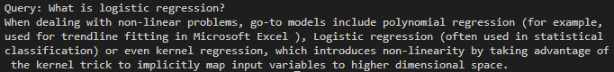

# Question-Answering System

## Description
Current research and development within artificial intelligence (AI) leveraging natural language processing (NLP) is producing human-interactable systems including chatbots (such as ChatGPT) and question-answering (QA) systems (such as IBM Watson). This project will focus on developing a QA system that performs two tasks: document retrieval and passage retrieval. With access to a corpus of text documents, when the system is presented with a question query, a document retrieval is performed to identify documents most relevant to the query. Once the top documents are found, the documents would then be partitioned into passage so that the most relevent passage to the question can be determined. Overall, this intelligent system determines the most relevant document(s) using tf-idf (term frequency - inverse document frequency) ranking then extracts the most relevant sentence(s) using idf (inverse document frequency) and a query term density measure.

## References
- https://www.analyticsvidhya.com/blog/2021/11/end-to-end-question-answering-system-using-nlp-and-squad-dataset/

- https://en.wikipedia.org/wiki/Tf%E2%80%93idf